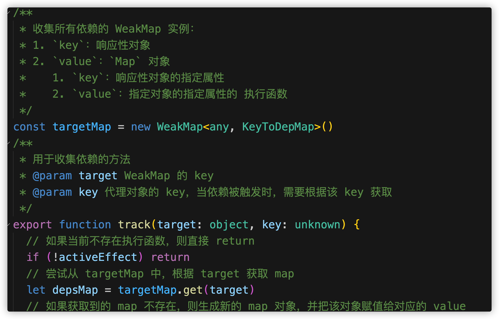

# vue-next-mini（vue3 源码精简版）

让更多的人以更简单的方式学习 `vue 3` 源码


## 如何做到？

1. 与 `vue 3` 源码保持相同的 **函数、变量、类、接口、模块** 等命名方式
2. 抛离边缘情况，仅关注核心逻辑
3. 详细到了极致的代码注释
   
4. 以 **测试实例** 为驱动的核心逻辑解析方式


## 核心模块

1. compiler-core 
2. compiler-dom
3. reactivity
4. runtime-core
5. runtime-dom
6. shared
7. vue
8. vue-compat


## 开发标准

### 没有使用就当做不存在

因为在 `vue` 的源码中，它会存在很多边缘情况的处理。比如：

> 用户传递的数据不符合规定，那么应该抛出一个什么类型的错误，不同的类型抛出的错误内容也会不一样。

像这种无关核心逻辑的边缘情况，我们会把它们当做不存在，从而使我们更加专注于核心逻辑，避免陷入复杂的逻辑循环之中。


### 最少代码的实现逻辑

我们会针对指定的业务场景，来构建最清晰的实现路径。

因为我们避免了大量的边缘情况，所以这可以保证我们在实现的时候，完全专注于核心业务，业务的更加专注，就意味着业务的更加清晰。从而 **以最少的学习成本来达到最大的学习收益** 。


## 运行

1. 使用 `pnpm` 进行安装依赖

   ```shell
   pnpm i
   ```

2. 开发时：

   ```shell
   npm run dev
   ```

3. 打包：

   ```shell
   npm run build
   ```


测试实例查看 `packages/vue/examples` 


